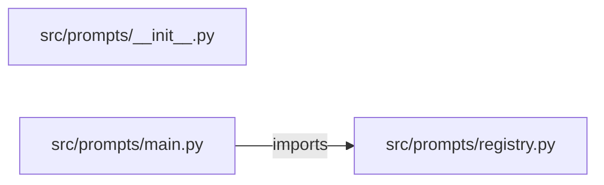

# prompt-management-platform — project architecture

[README](README.md) · [Interview questions and answers](INTERVIEW_QA.md)

## Purpose and scope

Register a prompt version and promote a champion prompt.

This document describes files and symbols in this checkout. Deployment templates and statements in the original overview are distinguished from a verified running environment.

## Component diagram



For Python repositories, arrows show resolved local imports, not network calls or deployment order. Otherwise the diagram is a repository component map; containment arrows do not assert runtime integration.

## Components and responsibilities

| Component | Responsibility |
| --- | --- |
| [`src/prompts/main.py`](src/prompts/main.py) | HTTP handlers: `GET /healthz`, `GET /champion`, `POST /models`, `POST /promote` |
| [`src/prompts/registry.py`](src/prompts/registry.py) | Functions: `register`, `promote`, `champion` |
| [`requirements.txt`](requirements.txt) | Implementation or supporting configuration |
| [`src/prompts/__init__.py`](src/prompts/__init__.py) | Implementation or supporting configuration |
| [`tests/test_registry.py`](tests/test_registry.py) | Executable checks and regression examples |
| [`.github/workflows/ci.yml`](.github/workflows/ci.yml) | GitHub Actions job definitions |
| [`README.md`](README.md) | Project explanations or operating notes |

## Request interface

| Method and path | Handler | Source |
| --- | --- | --- |
| `GET /healthz` | `healthz` | [`src/prompts/main.py`](src/prompts/main.py#L8) |
| `GET /champion` | `get_champion` | [`src/prompts/main.py`](src/prompts/main.py#L13) |
| `POST /models` | `post_model` | [`src/prompts/main.py`](src/prompts/main.py#L18) |
| `POST /promote` | `post_promote` | [`src/prompts/main.py`](src/prompts/main.py#L26) |

The table lists literal route decorators found in the inspected Python modules. Router prefixes and middleware can add behavior; check the linked handler and application setup before calling an endpoint.

## Implementation walkthrough

### `promote(name)`

Source: [`src/prompts/registry.py`](src/prompts/registry.py#L16).

Calls visible in this function: `InputError`.

```python
def promote(name):
    if name not in MODELS:
        raise InputError("unknown model")
    global CHAMPION
    CHAMPION = name
    return {"champion": CHAMPION, "applied": False}
```

### `register(name, version, metrics)`

Source: [`src/prompts/registry.py`](src/prompts/registry.py#L9).

Calls visible in this function: `InputError`, `isinstance`.

```python
def register(name, version, metrics):
    if not isinstance(name, str) or not name:
        raise InputError("name is required")
    MODELS[name] = {"version": version, "metrics": metrics or {}}
    return {"name": name, **MODELS[name]}
```

### `champion()`

Source: [`src/prompts/registry.py`](src/prompts/registry.py#L24).

```python
def champion():
    return {"champion": CHAMPION, "model": MODELS[CHAMPION]}
```

## Validation and failure paths

| Explicit exception | Source |
| --- | --- |
| `HTTPException(status_code=422, detail=str(exc))` | [`src/prompts/main.py`](src/prompts/main.py#L22) |
| `HTTPException(status_code=422, detail=str(exc))` | [`src/prompts/main.py`](src/prompts/main.py#L30) |
| `InputError('name is required')` | [`src/prompts/registry.py`](src/prompts/registry.py#L11) |
| `InputError('unknown model')` | [`src/prompts/registry.py`](src/prompts/registry.py#L18) |

These are explicit exceptions in the inspected source, rather than a claim that every failure is handled. Follow the calling handler to see whether the exception becomes an HTTP response or propagates.

## Data and state

- [`src/prompts/registry.py`](src/prompts/registry.py) defines module-level containers: `MODELS`.

Module-level dictionaries/lists live in a Python process. They can be fixtures or mutable state; inspect writes before treating them as persistent storage. A production extension would need to define persistence and concurrency behavior explicitly.

## Data flow and design decisions

### What is the input-to-output contract of `promote`

In [`src/prompts/registry.py`](src/prompts/registry.py#L16), `promote(name)` receives the inputs. The function computes these intermediate values:

- `CHAMPION = name`

Its result is defined by:

- `{'champion': CHAMPION, 'applied': False}`

### Which decision rules or boundary conditions should an interviewer challenge

The implementation in [`src/prompts/registry.py`](src/prompts/registry.py#L16) branches on:

- `name not in MODELS`

A useful extension is a table-driven test that covers each condition just below, at, and above its boundary where applicable. These expressions are the current rules; changing them changes behavior and should be justified by the project’s acceptance criteria.

## Setup and verification

The following commands are derived from the checked-in dependency/test contracts. Execute them from the repository root; the block prepares a local environment, not a cloud deployment.

```bash
python3 -m venv .venv
source .venv/bin/activate
python -m pip install -r requirements.txt
python -m pytest -q
```

Python dependencies: [`requirements.txt`](requirements.txt).

Test entry points: [`tests/test_registry.py`](tests/test_registry.py).

Automation definitions: [`.github/workflows/ci.yml`](.github/workflows/ci.yml). Read their triggers and job steps to determine what CI actually runs.

## Operating boundaries and design review

Before turning this checkout into a customer deployment, establish the input contract, data ownership, access controls, failure response, evaluation criteria, and rollback owner. Repository fixtures and unit tests demonstrate local behavior; they do not establish throughput, uptime, compliance, or business impact.

A useful architecture review starts with the linked implementation: identify where input enters, where a decision is made, which state can change, and which external dependency can fail. Add a deployment view only for infrastructure that is actually configured and exercised.
